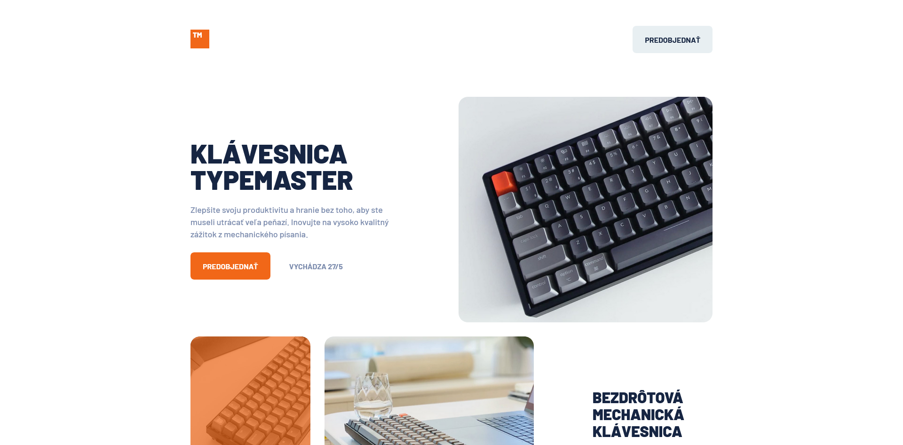
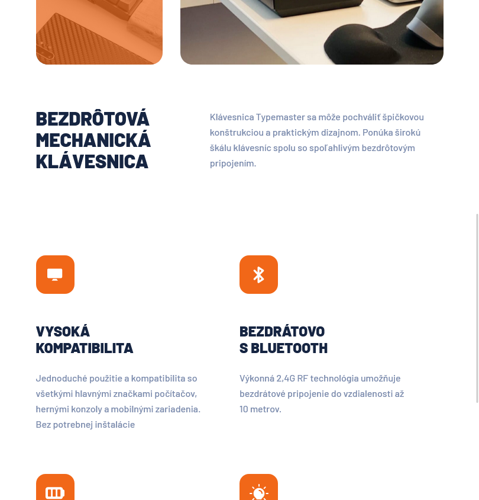

# Frontend Mentor - Typemaster pre-launch landing page

## 📝 Informácie o projekte

Tento projekt je zo stránky [Frontend Mentor](https://www.frontendmentor.io/challenges/typemaster-prelaunch-landing-page-J6-Yj5J-X). Stránka Frontend Mentor je online platforma určená pre webových vývojárov, ktorí sa chcú zdokonaliť v oblasti frontendu. Obsahuje rôzne projekty, ktoré sú zamerané na vývoj webových stránok a aplikácií, a ktoré majú rôzne náročnosti a témy. Na stránke nájdete kompletné zadania projektov, ktoré obsahujú náhľady dizajnu, napríklad vo Figme.

Projekt je webová stránka v slovenčine. Obsahuje základné metadáta, titul stránky, faviconu, CSS a JavaScript súbory pre rôzne časti stránky. Stránka má hlavičku s logom a tlačidlom na predobjednávku, obsahuje aj hlavnú sekciu s popisom a obrázkom produktu, ako aj sekciu s funkciou produktu.

Používatelia tejto stránky môžu:

- prezerať si ju na desktope, tablete alebo na mobilnom zariadení
- vidieť interaktívne prvky pri prechádzaní stránkou

Po kliknutí na logo sa zobrazí môj predchádzajúci projekt zo stránky [Frontend Mentor](https://github.com/tomasdunik/frontend-mentor__faq-accordion-card.git).

#### [Odkaz na hotovú stránku](https://tomasdunik.github.io/frontend-mentor__typemaster-pre-launch-landing-page/)

 

## 🏗️ Vytvorenie projektu

Projekt som vytvoril za približne 6 hodín (čas od stiahnutia projektu až po jeho finálne publikovanie na stránke Frontend Mentor). Použil som HTML, SCSS a jQuery. Projekt má responzívny dizajn pre desktop, tablet a mobilné zariadenia. Anglické texty som upravil na slovenské.

Projekt využíva knižnicu jQuery na manipuláciu s DOM prvkami na webovej stránke. Prvý a druhý blok jQuery kódu definuje funkciu, ktorá mení farbu pozadia a farbu textu tlačidla v záhlaví, keď kurzor myši vstupuje alebo opúšťa tento prvok. Tretí blok jQuery kódu skrýva prvky v sekcii "Section features" a potom ich postupne zobrazuje, keď sa stránka posúva dolu a každý prvok sa zobrazí s oneskorením.

 

## 🏫 Čo som sa naučil

- V projekte som prvýkrát pracoval s jQuery.

 

## 🛠️ Vytvorené s

- HTML
- CSS
- SCSS
- JavaScript
- jQuery

 

## 📸 Screenshots

### 💻 Desktop

### 📱 Tablet

### 📱 Mobil

 

## 🔗 Projekty Frontend Mentor

- [Tento konkrétny projekt na stránke Frontend Mentor](https://www.frontendmentor.io/solutions/my-version-typemaster-prelaunch-landing-page-with-jquery-A7EhSjPrZ4)
- [Moje ostatné projekty na stránke Frontend Mentor](https://www.frontendmentor.io/profile/WeekendsProgrammer)
